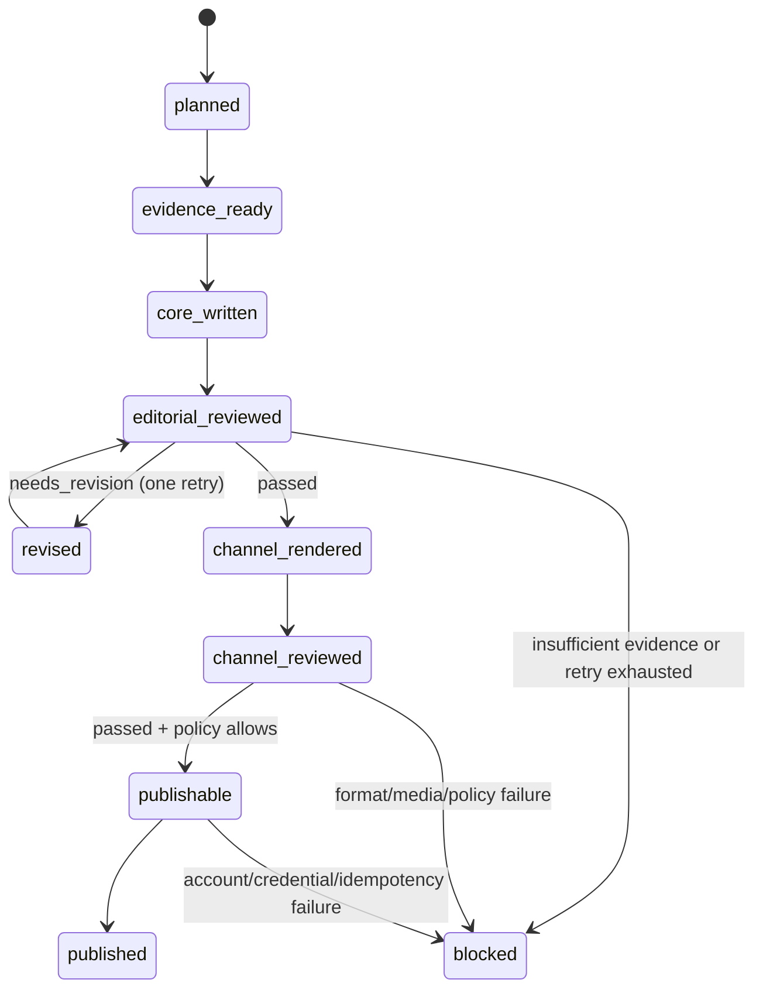

# 자율 콘텐츠 운영 모델

## 이 문서의 목적

이 프로젝트의 목표는 KB부동산에만 묶인 하나의 거대한 자동화가 아니다.
도메인별 수집기와 채널별 게시기를 느슨하게 연결하고, 로컬에서 실행되는 LLM 세션이 근거 기반으로 작성·검수·개선한 뒤 정해진 정책에 따라 발행하는 재사용 가능한 콘텐츠 운영 체계다.

이 문서는 현재 저장소의 프롬프트와 모듈을 다음 원칙으로 정리한다.

- **도메인 교체 가능**: KB부동산, 여행, 상품, 뉴스 등은 `도메인 어댑터`만 교체한다.
- **콘텐츠 원본은 하나**: 블로그·텔레그램·Instagram마다 처음부터 별도 글을 쓰지 않는다.
- **채널은 마지막에 렌더링**: 채널별 길이·문법·이미지 규격만 어댑터가 변환한다.
- **검수는 작성과 분리**: 작성 세션이 자신의 결과를 합격 처리하지 않는다.
- **무인 발행은 정책으로만 허용**: 사람의 매번 승인 문구가 아니라, 사전에 고정한 품질·대상 계정·시간·재시도 정책이 발행 권한을 결정한다.
- **모든 단계는 파일 계약으로 연결**: 세션끼리 대화 기억에 의존하지 않고, 입력·출력 파일과 해시만 신뢰한다.

## 현재 구현과 목표 상태

| 영역 | 현재 상태 | 목표 상태 |
|---|---|---|
| KB 데이터·뉴스·실거래 | `kb_agents`로 분리 구현됨 | 다른 도메인도 같은 입력 계약으로 어댑터만 추가 |
| 콘텐츠 패키지 | `content-package/v1` 구현됨 | 채널 렌더링 전의 `editorial-core/v1`을 추가 |
| 채널 프롬프트 | 블로그·텔레그램·Instagram·카드뉴스·알림톡별로 중복 생성 | 공통 편집 원칙은 한 번만 적용하고 채널 어댑터가 변환 |
| 품질 검수 | 파일·날짜·필수 프롬프트 중심의 규칙 검수 | 근거·정책·채널 적합성·LLM 심사 점수를 분리 검수 |
| Instagram 발행 | 해시 승인 문구와 이중 환경 스위치가 있어 기본 안전 모드 | 사전 승인된 `autonomy policy`가 만족될 때만 무인 발행 |
| GPT 데스크톱 활용 | 사람이 세션에 요청하는 고품질 작성·검토 | 세션 프롬프트는 그대로 재사용하되, 무인 실행은 로컬 스케줄러와 LLM 호출 러너가 담당 |

현재 `instagram-content-publisher`의 사람 승인 절차를 우회하거나 자동으로 켜지 않는다. 이 문서의 자율 발행은 별도의 구현 과제이며, `autopublish=false`가 기본값이다.

## 기존 프롬프트에서 추출한 공통 편집 정책

다음 원칙은 `reports/prompts/`의 블로그·텔레그램·Instagram·카드뉴스·알림톡 프롬프트에 반복돼 있었으므로 채널과 분리한다.

1. 제공된 KB 통계, 실거래, 뉴스, 이미지 후보 외의 수치·단지명·정책 사실을 만들지 않는다.
2. 확인할 수 없는 인과관계는 단정하지 않고, 불확실성을 문장에 드러낸다.
3. 기준일을 유지하고, 서울 25개 구 매매·전세와 수도권/비수도권 매매·전세 상승 상위 섹션을 제공된 순서 그대로 다룬다.
4. 각 섹션은 `연속 상승 주수 → 해당 지역 실거래 → 해석` 순서로 연결한다. 별도 실거래 장을 만들지 않는다.
5. 거래가 없으면 `최근 거래 없음`을 그대로 보존하며 빈 데이터를 꾸며 채우지 않는다.
6. 뉴스는 제공된 기사만 사용하고 URL을 수정·축약하지 않는다.
7. 모든 문장은 한국어 존댓말로, 과장·낚시·투자 권유 없이 작성한다.
8. 출처·면책 문구·이미지 출처/삽입 후보를 잃지 않는다.

아래 항목만 채널 어댑터의 책임으로 남긴다.

| 채널 | 어댑터 전용 책임 |
|---|---|
| 네이버 블로그 | Markdown 구조, 긴 설명, 표, 이미지 삽입 위치, 참고 링크 |
| 텔레그램 | 일반 텍스트 가독성, Markdown 금지, 짧은 뉴스레터 구조 |
| Instagram | 2,200자 이내 캡션, 해시태그·CTA 정책, 공개 HTTPS 미디어 |
| 카드뉴스 | 16장 장면 분할, 표지의 날짜 우선 계층, 편집 가능한 원본 요소 |
| 알림톡 | 채널 정책에 맞는 짧은 본문과 길이 제한 |

기존 `reports/prompts/*.txt`와 `reports/prompts/archive/`는 실행 이력이다. 새 구조로 전환해도 덮어쓰거나 삭제하지 않는다.

## 세션과 파일 계약

각 실행은 `run_id` 하나로 묶는다. 예시는 다음과 같다.

```text
runs/2026-07-31T210000+0900_kb-weekly/
  00_run_manifest.json
  01_evidence/fact_pack.json
  02_editorial/editorial_core.md
  02_editorial/editorial_core.json
  03_review/editorial_review.json
  04_revision/editorial_core_revised.md
  05_channel/instagram_package.json
  05_channel/naver_blog.md
  06_channel_review/channel_review.json
  07_publish/publish_receipt.json
```

`runs/`는 이후 러너가 만드는 경로다. 지금은 아래 프롬프트가 합의하는 제안 계약이며, 기존 `outputs/`와 `reports/`를 바꾸지 않는다.

### 필수 공통 필드

모든 JSON 산출물은 최소한 다음을 포함한다.

```json
{
  "schema_version": ".../v1",
  "run_id": "2026-07-31T210000+0900_kb-weekly",
  "input_digest": "sha256:...",
  "status": "passed",
  "created_at": "2026-07-31T12:00:00Z",
  "producer": "session-key"
}
```

- `input_digest`가 다르면 다음 세션은 산출물을 사용하지 않는다.
- 이전 단계 파일은 수정하지 않는다. 수정본은 다음 단계 디렉터리에 새 파일로 쓴다.
- `status`는 `passed`, `needs_revision`, `blocked`, `failed` 중 하나다.
- 근거가 부족하면 `blocked`와 부족한 근거 목록을 남기고 추측으로 진행하지 않는다.

## 독립 세션 구성

세션 프롬프트는 [`prompts/autonomous_sessions/`](../prompts/autonomous_sessions/)에 있다. 각 세션은 하나의 책임과 하나의 출력 경로만 가진다.

| 순서 | 세션 키 | 책임 | 읽는 것 | 쓰는 것 |
|---:|---|---|---|---|
| 0 | `00_director` | 실행 계획·의존성·경로 확정 | 요청, 정책, 최신 입력 | `00_run_manifest.json` |
| 1 | `10_evidence` | 도메인 데이터를 사실 묶음으로 정규화 | 스냅샷·뉴스·원천 메타데이터 | `01_evidence/fact_pack.json` |
| 2 | `20_editorial_core` | 채널 중립 콘텐츠 원본 작성 | 사실 묶음 | `02_editorial/editorial_core.*` |
| 3 | `30_editorial_review` | 근거·누락·과장·정책 위반 독립 검토 | 콘텐츠 원본·사실 묶음 | `03_review/editorial_review.json` |
| 4 | `40_revision` | 검수 지적만 반영한 개선본 작성 | 원본·검토 결과·사실 묶음 | `04_revision/editorial_core_revised.*` |
| 5 | `50_channel_render` | 채널별 표현과 미디어 패키지 생성 | 최종 콘텐츠 원본·채널 정책 | `05_channel/*` |
| 6 | `60_channel_review` | 채널 길이·문법·해시·미디어 검증 | 채널 산출물·정책 | `06_channel_review/channel_review.json` |
| 7 | `70_publish` | 정책 조건을 만족한 산출물만 게시 | 발행 계획·채널 검수·계정 상태 | `07_publish/publish_receipt.json` |

`20_editorial_core`와 `30_editorial_review`는 반드시 다른 세션으로 실행한다. 1차 콘텐츠가 `needs_revision`이면 `40_revision`을 한 번만 실행하고, 다시 `30_editorial_review`를 실행한다. 두 번째에도 실패하면 자동 발행하지 않고 `blocked`로 종료한다. 이 제한이 끝없는 자기개선 루프와 비용 폭주를 막는다.

### 병렬 실행 원칙

작업 수를 늘린다고 같은 글을 여러 세션이 동시에 쓰게 하면 품질보다 충돌이 커진다. 병렬화는 독립된 산출물에서만 한다.

| 구간 | 실행 방식 | 이유 |
|---|---|---|
| `00 → 10 → 20 → 30` | 순차 | 다음 단계가 앞 단계의 확정 근거·원본을 필요로 함 |
| `40 → 30` | 순차, 최대 1회 | 개선본을 독립 검수해야 함 |
| `50_channel_render` | 채널별 병렬 | 같은 확정 원본을 Instagram·블로그·텔레그램 등이 각각 읽기만 함 |
| `60_channel_review` | 채널별 병렬 | 각 채널의 길이·미디어 규칙이 독립적임 |
| `70_publish` | 계정별 순차 | 중복 게시와 같은 계정의 동시 발행을 방지 |

세션 이름은 `{{RUN_ID}}__20_editorial_core`, `{{RUN_ID}}__50_instagram_render`처럼 `run_id + 역할`로 통일한다. 이 이름만으로도 다른 프로젝트·다른 주차의 산출물이 섞이는 일을 줄일 수 있다.

## 실행 상태 전이



## 자율 발행 정책

사람 개입이 없는 발행은 “승인 생략”이 아니라 “사전에 기계가 확인 가능한 승인 조건을 고정”하는 것이다. 다음 파일은 구현 목표다.

```json
{
  "schema_version": "content-autonomy-policy/v1",
  "policy_id": "kb-weekly-instagram-v1",
  "autopublish": false,
  "targets": ["instagram"],
  "allowed_account_aliases": ["example_account"],
  "allowed_schedule": {"timezone": "Asia/Seoul", "weekday": "fri", "start": "09:00", "end": "11:00"},
  "minimum_editorial_score": 90,
  "minimum_channel_score": 100,
  "max_revision_attempts": 1,
  "require_public_https_media": true,
  "require_content_digest_match": true,
  "failure_action": "block_and_alert",
  "idempotency_window_hours": 168
}
```

`autopublish`를 `true`로 바꾸기 전에는 최소한 아래를 실제로 검증해야 한다.

1. 대상 플랫폼의 공식 API 권한·토큰·공개 HTTPS 미디어가 준비돼 있다.
2. 첫 3~5회는 `shadow` 모드로 실행하여 게시 직전 산출물과 검수 결과를 축적했다.
3. 잘못된 계정, 중복 게시, 링크/날짜 오류, 미디어 처리 실패에 대한 테스트가 있다.
4. 실패 시 재시도 한도와 알림 수신처가 설정돼 있다.

## GPT 데스크톱과 소스 코드의 역할

- **GPT/Codex 데스크톱 세션**: 복잡한 편집 판단, 근거 대조, 문구 개선, 코드·산출물 검토에 사용한다. 이 문서의 역할별 프롬프트를 별도 작업에 붙여 넣어도 같은 파일 계약을 사용한다.
- **프로젝트 러너와 스케줄러**: 정해진 시간에 입력을 모으고, 각 세션/모델 호출의 입출력을 저장하며, 재시도·중복 방지·발행을 처리한다. UI 클릭을 자동화의 기반으로 두지 않는다.
- **MCP**: 데이터·파일·게시 같은 외부 능력의 연결 계층이다. 글을 잘 쓰는 모델 자체가 아니므로, LLM 작성 세션과 명확히 분리한다.

즉, 데스크톱 GPT가 고품질 편집을 맡을 수는 있지만, 완전 무인 운영의 실행 주체는 로컬 스케줄러와 명시적인 LLM 호출 러너여야 한다. 현재 저장소에는 KB 파이프라인과 Instagram 게시 어댑터가 있고, 위 `run manifest`·LLM 러너·정책 게이트는 다음 구현 단계다.

## 다른 프로젝트에 복제하는 방법

1. `10_evidence`만 해당 도메인의 `fact_pack` 형식으로 교체한다.
2. `20`~`40`의 공통 편집·검수 프롬프트는 유지한다.
3. 새 플랫폼이 필요하면 `50_channel_render`의 채널 정책과 Publisher MCP만 추가한다.
4. `content-package/v1`은 그대로 사용하고, 도메인 정보는 `metadata.source_project` 아래에 넣는다.
5. 자동 발행 전에는 항상 `autopublish=false` → `shadow` → `true` 순으로 전환한다.

## 다음 구현 우선순위

1. `run manifest`와 각 단계 JSON 스키마를 Python으로 구현한다.
2. 기존 KB 산출물을 `fact_pack.json`으로 변환하는 어댑터를 만든다.
3. GPT/Codex 또는 API 기반 LLM 러너를 하나 선택해 세션 프롬프트를 실행한다.
4. 규칙 검수와 LLM 독립 검수를 결합한 점수 기반 리뷰를 구현한다.
5. Instagram을 `shadow` 모드로 end-to-end 검증한 뒤, 정책 기반 무인 발행을 추가한다.
